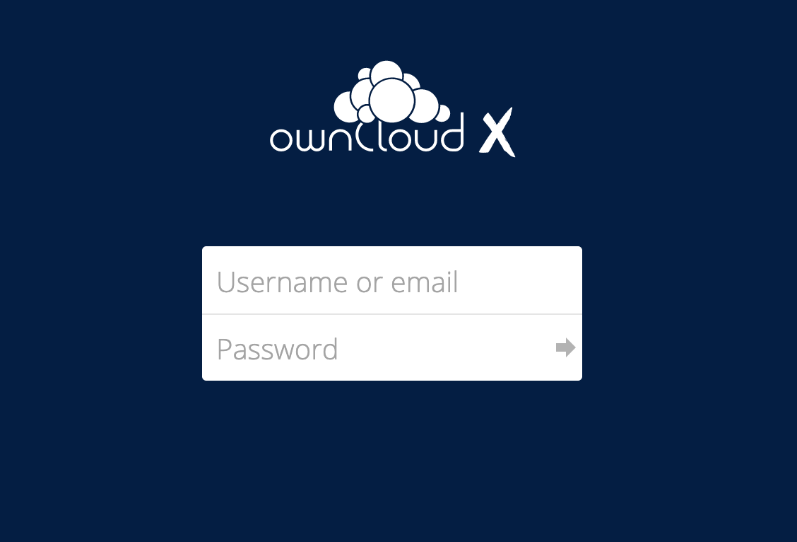

# Owncloud quickstart 

The Owncloud quickstart is published using [Github Pages](https://pages.github.com/) and [Jekyll](https://docs.github.com/en/pages/setting-up-a-github-pages-site-with-jekyll).
The site covers installing, configuring, connecting, and logging into the Owncloud.
Github Pages site for the Owncloud quickstart is [here](https://xenolinux.github.io/Quickstart.html).

# What is Owncloud?

Owncloud is open-source file sync, share, and content collaboration software that lets teams work on data easily from anywhere, on any device.
It provides access to your data through a web interface while providing a platform to view, sync, and share across devices easily. Owncloud 
provides ready-to-deploy packages for popular Linux distributions such as Debian, Ubuntu, Fedora, RedHat Enterprise Linux, CentOS, and 
OpenSUSE. Owncloud can be installed using Docker as well.

## Contributing

To get started with the contribution, see [Contributing](https://doc.owncloud.com/server/10.7/how_to_contribute.html).

## Installation

The Owncloud server can be installed using Docker. The official [Owncloud Docker image](https://hub.docker.com/r/owncloud/server) can be used to evaluate Owncloud installation quickly. This image is designed to use Docker Compose.

1. Pull the official Owncloud Docker image.

```
$ sudo docker pull owncloud/server
Using default tag: latest
latest: Pulling from owncloud/server
a70d879fa598: Pull complete
c4394a92d1f8: Pull complete
10e6159c56c0: Pull complete
5bdbdd8c02c9: Pull complete
c28fd5140739: Pull complete
b4adc9f236b6: Pull complete
c7a4ab0bad17: Pull complete
6c0d74d082c5: Pull complete
71ebec94dc59: Pull complete
f5dcd6a55c7b: Pull complete
c3a2e20b5ef1: Pull complete
b32c9eb9a52a: Pull complete
50814a7fdbbf: Pull complete
092c112be29f: Pull complete
0c41a1d442be: Pull complete
cca5096ed065: Pull complete
38afde16f2d6: Pull complete
16acf77eb430: Pull complete
Digest: sha256:6bea93d75e8411216cd347eca3fa881ebab47d4e163f838c991f0704f401ad0d
Status: Downloaded newer image for owncloud/server:latest
docker.io/owncloud/server:latest
```

2. List out the Docker image. 
```
$ sudo docker images
REPOSITORY                                             TAG                   IMAGE ID       CREATED        SIZE
owncloud/server                                        latest                b83d7d38d29f   41 hours ago   1.22GB
```
3. List out the running Owncloud server container.
```
 docker ps
CONTAINER ID   IMAGE                  COMMAND                  CREATED      STATUS                  PORTS                    NAMES
df98b4cf1813   owncloud/server:10.7   "/usr/bin/entrypoint…"   3 days ago   Up 15 hours (healthy)   0.0.0.0:8080->8080/tcp   owncloud_server
```

4. Run the Docker image. You will see similar output as shown below. Port 8080, is exposed to allow HTTP connection.

```
sudo docker run -e OWNCLOUD_DOMAIN=localhost:8080 -p8080:8080 owncloud/server

Password:
Creating volume folders...
Creating hook folders...
Removing custom folder...
Linking custom folder...
Removing config folder...
Linking config folder...
Writing config file...
Fixing base perms...
Fixing data perms...
Fixing hook perms...
Installing server database...
creating sqlite db
ownCloud was successfully installed
ownCloud is already latest version
Writing objectstore config...
Writing php config...
Updating htaccess config...
.htaccess has been updated
Writing apache config...
Enabling cron background...
Set mode for background jobs to 'cron'
Touching cron configs...
Starting cron daemon...
Starting apache daemon...
[Wed Apr 21 01:35:28.222904 2021] [mpm_prefork:notice] [pid 263] AH00163: Apache/2.4.41 (Ubuntu) configured -- resuming normal operations
[Wed Apr 21 01:35:28.222963 2021] [core:notice] [pid 263] AH00094: Command line: '/usr/sbin/apache2 -f /etc/apache2/apache2.conf -D FOREGROUND'
```

5. If you open http://localhost:8080 in your browser of choice, where you see the standard ownCloud login screen, as in the image below.


